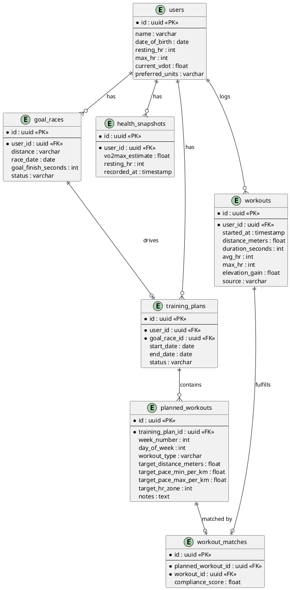

# Run Planner — Design Spec
*Date: 2026-03-24*

## Overview

A personalized iOS running coach app that generates structured training plans and tracks progress using data ingested from Apple Health. Plans are grounded in Jack Daniels' VDOT methodology — a mathematical framework that derives training paces from VO2 max — supplemented by AI for structural plan decisions and adjustments.

Built primarily for an advanced runner (15 years experience) with eventual expansion to casual and intermediate runners. The iOS app is a thin client; all business logic lives in a Java backend.

---

## Architecture

### Two deployable units

**Flutter iOS app**
- Reads Apple Health data via HealthKit: workouts, heart rate history, VO2 max estimate
- Displays training plans, individual workout details, and progress
- Sends health data snapshots to the backend via REST
- No business logic on-device

**Spring Boot monolith (Java 25, PostgreSQL)**
- Owns all plan generation, VDOT math, AI integration, and data storage
- Exposes a REST/JSON API consumed by the Flutter app
- Internal package structure:
  - `health` — ingests and stores Apple Health data (workouts, HR, VO2 max history)
  - `vdot` — pure math engine: VDOT score calculation, training zones, target paces for all workout types
  - `plan` — generates and manages training plans; owns the weekly structure from today to race day
  - `adjustment` — compares completed workouts to planned workouts; modifies upcoming weeks based on performance
  - `ai` — wraps the LLM API (Claude or OpenAI); used by `plan` and `adjustment` for structural decisions
  - `user` — user profile, goal races, authentication

---

## Supported Race Distances

- 5K, 10K, half marathon, marathon
- Custom user-defined distances

---

## Training Methodology

**Jack Daniels' VDOT system**

A single VDOT score is derived from the user's VO2 max (sourced from Apple Health) or from a recent race/time trial performance. The VDOT score maps to precise target paces for five training zone types:

| Zone | Type | Purpose |
|------|------|---------|
| E | Easy | Aerobic base, recovery |
| M | Marathon pace | Race-specific aerobic work |
| T | Threshold | Lactate threshold improvement |
| I | Interval | VO2 max development |
| R | Repetition | Speed and economy |

The VDOT score is recalculated whenever a workout is ingested that resembles a race or time trial effort (high average HR, distance matching a standard race distance).

**AI role**
The LLM is used for structural plan decisions — macro weekly mileage progression, taper timing, workout variety balance — and for determining whether and how to adjust plans after performance deviations. The VDOT math engine provides all target paces; AI does not override pace calculations.

Future features (not in initial scope): natural language coaching commentary, conversational onboarding.

---

## Data Model

---

## Data Flow

### Onboarding
1. User enters profile (age, max HR) and goal race (distance, date, goal finish time)
2. Flutter app reads VO2 max estimate and recent workouts from Apple Health → sends to backend
3. Backend calculates initial VDOT from VO2 max, or from best recent race time if available
4. Backend generates full training plan using VDOT paces; AI shapes macro structure (mileage progression, taper, workout variety)
5. Plan returned to Flutter app for display

### Ongoing sync (on app open or periodic background sync)
1. Flutter app reads new workouts from Apple Health since last sync → sends to backend
2. Backend stores raw workouts; attempts to match each to a planned workout
3. Adjustment engine compares actual vs. planned (pace, HR, distance, completion)
4. If meaningful deviation detected (missed workouts, consistent under/over performance), backend recalculates upcoming plan weeks; AI decides whether to restructure or adjust paces
5. Updated plan returned to app

### VDOT recalculation
Triggered when an ingested workout resembles a race or time trial (high avg HR, distance near a standard race distance). New VDOT score updates training paces for all remaining planned workouts.

---

## Error Handling

- **Apple Health sync** — best-effort; partial data is accepted and stored, never a hard failure
- **Missing VO2 max** — falls back to prompting the user for a recent race time or estimated goal pace to seed initial VDOT
- **AI call failure** — non-blocking; backend generates plan using pure VDOT math rules as fallback, retries AI enrichment asynchronously
- **Plan adjustment** — runs asynchronously; never blocks the user's view of their current plan; adjustments apply on next app open

---

## Testing Strategy

- **VDOT engine** — thorough unit test coverage; pure math with deterministic inputs/outputs; edge cases include very low/high VDOT scores, missed training weeks, proximity to race day
- **Adjustment logic** — unit tested with stubbed AI seam; covers over-performance, under-performance, missed weeks, and consecutive deviation scenarios
- **REST API** — integration tests for all endpoints and the Apple Health ingestion pipeline
- **AI layer** — isolated behind an interface; stubbed in all automated tests; real LLM calls limited to manual/exploratory testing
- **Flutter** — widget tests for key screens (plan view, workout detail); no business logic to unit test

---

## Out of Scope (Initial Release)

- Natural language coaching commentary
- Conversational onboarding assistant
- Beginner/intermediate plan tiers (advanced runner profile only)
- Android support
- Web dashboard
