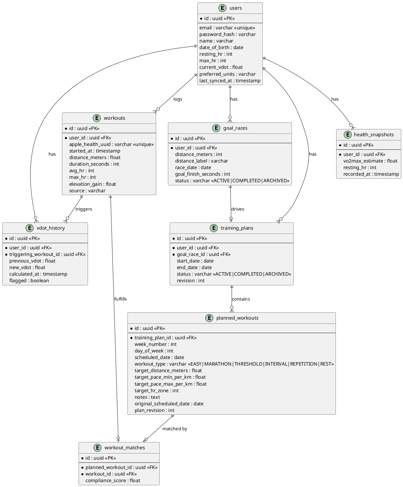

# Run Planner — Design Spec
*Date: 2026-03-24*

## Overview

A personalized iOS running coach app that generates structured training plans and tracks progress using data ingested from Apple Health. Plans are grounded in Jack Daniels' VDOT methodology — a mathematical framework that derives training paces from VO2 max — supplemented by Claude AI for structural plan decisions and adjustments.

Built primarily for an advanced runner (15 years experience) with eventual expansion to casual and intermediate runners. The iOS app is a thin client; all business logic lives in a Java backend.

---

## Architecture

### Two deployable units

**Flutter iOS app**
- Reads Apple Health data via HealthKit: workouts, heart rate history, VO2 max estimate
- Displays training plans, individual workout details, and progress
- Sends health data snapshots to the backend via REST
- No business logic on-device
- Syncs on app open (background sync deferred to coaching notification feature)

**Spring Boot monolith (Java 25, PostgreSQL)**
- Owns all plan generation, VDOT math, AI integration, and data storage
- Exposes a versioned REST/JSON API (`/api/v1/...`) consumed by the Flutter app
- Deployed locally during initial development; Flutter app points to localhost/LAN
- Internal package structure:
  - `health` — ingests and stores Apple Health data (workouts, HR, VO2 max history)
  - `vdot` — pure math engine: VDOT score calculation, training zones, target paces for all workout types
  - `plan` — generates and manages training plans; owns the weekly structure from today to race day
  - `adjustment` — compares completed workouts to planned workouts; modifies upcoming weeks based on performance
  - `ai` — wraps the Claude API (Anthropic); used by `plan` and `adjustment` for structural decisions
  - `user` — user profile, goal races, JWT authentication

---

## Supported Race Distances

- 5K (5,000m), 10K (10,000m), half marathon (21,097m), marathon (42,195m)
- Custom user-defined distances (stored as meters)

---

## Training Methodology

**Jack Daniels' VDOT system**

A single VDOT score is derived from the user's VO2 max (sourced from Apple Health) or from a recent race/time trial performance. The VDOT score maps to precise target paces for five training zone types:

| Zone | Type | Purpose |
|------|------|---------|
| E | Easy | Aerobic base, recovery |
| M | Marathon pace | Race-specific aerobic work |
| T | Threshold | Lactate threshold improvement |
| I | Interval | VO2 max development |
| R | Repetition | Speed and economy |

**VDOT recalculation triggers:**
A recalculation is triggered when an ingested workout meets all of the following criteria:
- Average HR ≥ 90% of the user's recorded max HR
- Distance is within 5% of a supported race distance (5K, 10K, half, marathon) or a user-defined custom race distance
- Duration is at least 10 minutes

On recalculation, the new VDOT score and the triggering workout ID are recorded in `vdot_history`. The `users.current_vdot` field is updated to reflect the new score. If a recalculation produces a VDOT change of more than 5 points in a single workout, it is flagged for review rather than auto-applied (likely a data anomaly).

**AI role (Claude API)**
Claude is used for structural plan decisions — macro weekly mileage progression, taper timing, workout variety balance — and for determining whether and how to adjust plans after performance deviations. Prompts return structured JSON. The VDOT math engine provides all target paces; Claude does not override pace calculations. All Claude calls are non-blocking with pure VDOT math fallback if the call fails.

Future features (not in initial scope): natural language coaching commentary, conversational onboarding, background sync with push notifications.

---

## Authentication

JWT-based authentication with email and password. Tokens are issued on login and must be included in the `Authorization: Bearer <token>` header on all API calls. Refresh token support included. The `users` table stores a hashed password (bcrypt) and email as the login identity.

---

## Data Model

### Status enumerations

**`goal_races.status`**
- `ACTIVE` — current goal race, plan is live
- `COMPLETED` — race date has passed
- `ARCHIVED` — manually dismissed by user

**`training_plans.status`**
- `ACTIVE` — currently in use (one per user at a time)
- `COMPLETED` — race date passed
- `ARCHIVED` — superseded by a new plan or manually dismissed

Only one `training_plan` per user may have status `ACTIVE` at a time (enforced at the service layer).

### Compliance score formula

`compliance_score` is a value between 0.0 and 1.0 calculated as a weighted average of three factors:

| Factor | Weight | Calculation |
|--------|--------|-------------|
| Distance completion | 40% | `min(actual_distance / target_distance, 1.0)` |
| Pace accuracy | 40% | `1.0 - clamp(|actual_pace - target_pace_mid| / target_pace_range, 0, 1)` |
| HR zone accuracy | 20% | `1.0` if avg HR within target zone, else `0.5` if within one zone, else `0.0` |

A `compliance_score` of 1.0 is a perfect match. A score below 0.6 is considered a significant deviation.

### Plan adjustment thresholds

The adjustment engine triggers a plan recalculation when any of the following conditions are met:
- Two or more consecutive planned workouts have `compliance_score < 0.6`
- A long run (the week's longest planned workout) is missed entirely (no match found within ±1 day)
- The user's VDOT score changes by more than 2 points (indicating meaningful fitness change)

Minor adjustments (pace nudges only, no structural change) are applied when:
- Three of the last five workouts have `compliance_score` between 0.6 and 0.75

---

## Data Flow

### Onboarding
1. User registers with email and password; receives JWT
2. User enters profile (date of birth, max HR) and goal race (distance, date, goal finish time)
3. Flutter app reads VO2 max estimate and recent workouts from Apple Health → sends to `/api/v1/health/sync`
4. Backend calculates initial VDOT from VO2 max, or from best recent race-like workout if available
5. Backend calls Claude to determine macro plan structure (weekly mileage progression, workout distribution, taper)
6. Backend generates full training plan using VDOT paces for each workout type and Claude's structure
7. Plan returned to Flutter app for display

### Ongoing sync (on app open)
1. Flutter app reads new workouts from Apple Health since `users.last_synced_at` → sends to `/api/v1/health/sync`
2. Backend stores raw workouts, deduplicating by `apple_health_uuid`; updates `last_synced_at`
3. Backend attempts to match each new workout to a `planned_workout` within ±1 day of `scheduled_date`
4. `compliance_score` is calculated for each match
5. Adjustment engine evaluates recent compliance against thresholds; if triggered, calls Claude to decide restructure vs. pace adjustment
6. If VDOT recalculation criteria are met, new VDOT is calculated and `vdot_history` is recorded
7. Updated plan returned to app (adjustments are applied before response, not deferred)

### VDOT recalculation
Triggered during sync when an ingested workout meets all recalculation criteria (see Training Methodology). The new VDOT updates `users.current_vdot` and is recorded in `vdot_history`. All remaining `planned_workouts` in the active plan have their target paces recalculated using the new VDOT score.

---

## Error Handling

- **Apple Health sync** — best-effort; partial data accepted and stored, never a hard failure; duplicate workouts silently skipped via `apple_health_uuid` uniqueness
- **Missing VO2 max** — falls back to prompting the user to enter a recent race time or estimated goal pace to seed initial VDOT
- **Claude API failure** — non-blocking; backend generates plan using pure VDOT math rules as fallback; retries Claude enrichment asynchronously on next sync
- **VDOT anomaly** — changes >5 points flagged in `vdot_history` and not auto-applied; user notified in app
- **Active plan conflict** — service layer rejects creation of a second `ACTIVE` plan; existing plan must be archived first

---

## Testing Strategy

- **VDOT engine** — thorough unit test coverage; pure math with deterministic inputs/outputs; edge cases include very low/high VDOT scores, missed training weeks, proximity to race day, anomaly flagging
- **Compliance score** — unit tested with known inputs and expected outputs for all three factors and boundary conditions
- **Adjustment logic** — unit tested with stubbed Claude seam; covers over-performance, under-performance, missed long runs, VDOT-triggered adjustment, and minor pace nudge scenarios
- **REST API** — integration tests for all `/api/v1/` endpoints and the Apple Health ingestion pipeline, including deduplication behavior
- **Claude layer** — isolated behind an interface; stubbed in all automated tests; real API calls limited to manual/exploratory testing
- **Flutter** — widget tests for key screens (plan view, workout detail); no business logic to unit test

---

## Out of Scope (Initial Release)

- Natural language coaching commentary
- Conversational onboarding assistant
- Background sync and push notifications
- Beginner/intermediate plan tiers (advanced runner profile only)
- Android support
- Web dashboard
- Cloud deployment (local only initially)
